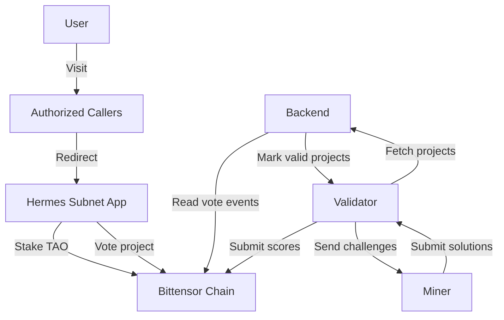
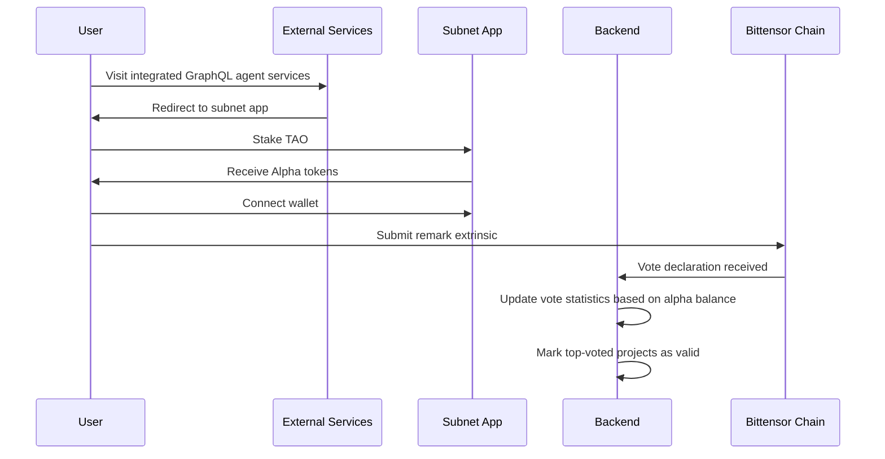
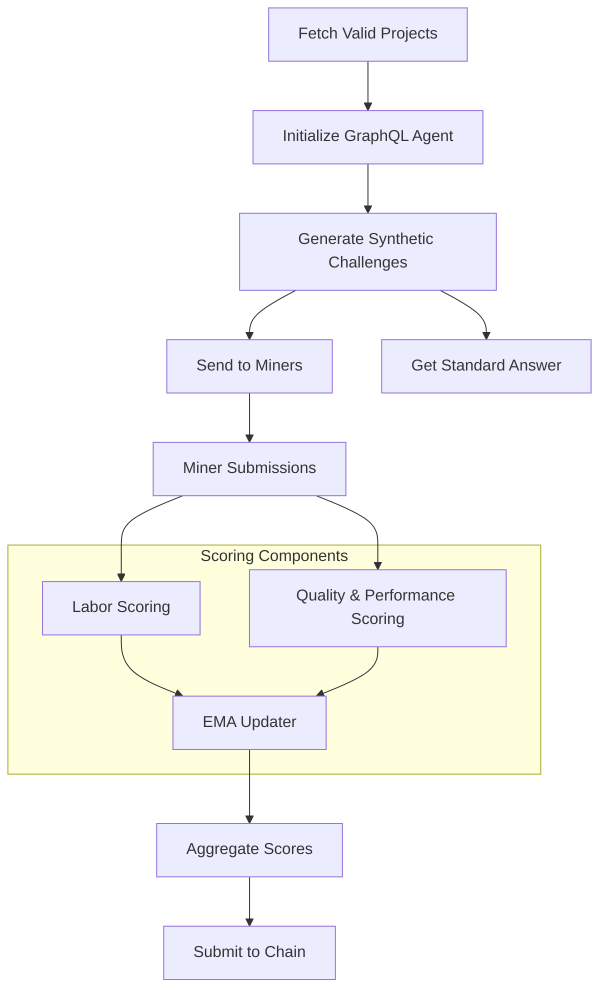
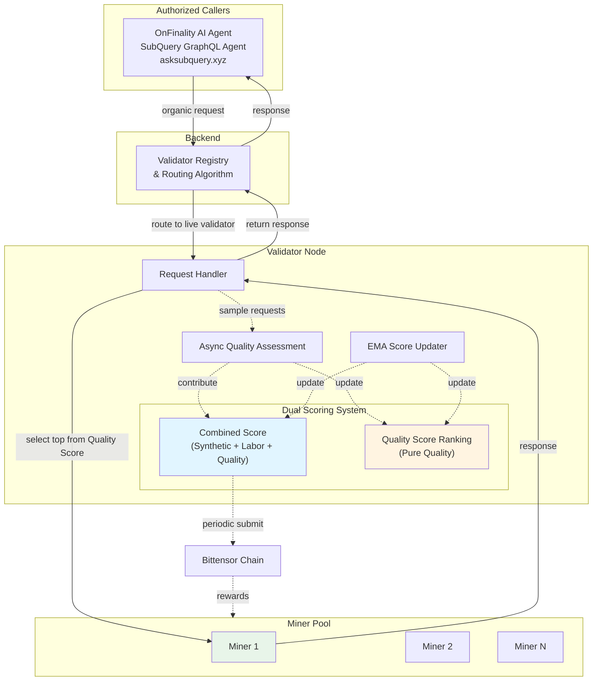

# High-Level Synthetic Challenges Architecture

## Overview

This document outlines the architecture for synthetic challenges generation in the Bittensor subnet, focusing on project selection, validator operations, and scoring mechanisms.

## Figure 1: High-Level Synthetic Challenges Diagram



## Project Selection and Generation Process



## Validator Synthetic Challenge Process



## Key Components

### 1. Hermes Subnet App
- **User Interface**: Main application for project interaction
- **Token Management**: Handles TAO staking and alpha token distribution
- **Wallet Integration**: Manages wallet connections and extrinsic submissions

### 2. Backend
- **Project Validation**: Marks projects with most alpha token votes as valid
- **Vote Statistics**: Updates vote counts based on alpha token balances
- **Project Distribution**: Provides valid project lists to validators

### 3. Authorized Callers
- **OnFinality AI Agent Service**:
- **SubQuery Network GraphQL Agent Service**:
- **AskSubQuery.xyz**: 

### 4. Validator
A typical bittensor subnet validator, plus
- **Project Fetching**: Regularly retrieves valid project lists from backend
- **Agent Initialization**: Sets up local GraphQL agents with project information
- **Challenge Generation**: Uses LLM to create synthetic challenges based on GraphQL schemas
- **Dual Scoring System**:
  - **Combined Score**: Synthetic labor + quality/performance + organic labor + organic quality → submitted to Bittensor chain
  - **Quality Score Ranking**: Pure quality metrics → used for selecting which miner serves organic requests
- **EMA Updates**: Aggregates multiple scores using exponential moving average

### 5. Miner
A typical bittensor subnet miner:
- **Challenge Processing**: Receives and processes synthetic challenges
- **Solution Generation**: Creates responses for validator evaluation
- **Auto Wiring Tools**:

## Technical Details

### Alpha Token Mechanics
- Alpha tokens are obtained by staking TAO
- Voting doesn't lock alpha tokens
- Backend periodically updates vote statistics based on alpha balance
- Top-voted projects receive validator attention

### Challenge Generation
- LLM generates synthetic challenges based on GraphQL schemas
- Validators use local agents for standard answers
- Challenges are distributed to all miners simultaneously

### Scoring System
- Labor scoring: Tracks completion and participation of miner responses
- Quality & Performance scoring: Evaluates accuracy and performance metrics
- EMA updater: Exponential moving average for score aggregation
- Periodic submission to Bittensor

#### Weight Calculation Algorithm

The Combined Score uses a weighted algorithm to balance quality and workload:

**Inputs:**
- `quality_scores`: Dictionary mapping miner UID → quality score (float between 0-1)
- `workload_counts`: Dictionary mapping miner UID → workload count (number of successful responses)
- `alpha`: Weight factor balancing quality vs workload importance (0-1 range)
  - Higher `alpha` → quality weighs more
  - Lower `alpha` → workload weighs more

**Algorithm Steps:**

1. **Normalize Workload**: Scale workload counts to 0-1 range using Min-Max normalization
   ```
   normalized_workload = (workload_count - min_workload) / (max_workload - min_workload)
   ```
   If all miners have equal workload or only one miner exists, set normalized_workload to 0.5 or 1.

2. **Calculate Combined Score**: Merge normalized quality and workload using alpha factor
   ```
   combined_score = alpha * quality_score + (1 - alpha) * normalized_workload
   ```

3. **Normalize Final Weights**: Normalize all combined scores to sum to 1 for Bittensor weight distribution
   ```
   final_weight = combined_score / sum(all_combined_scores)
   ```

This ensures miners are rewarded for both high-quality responses and consistent workload participation.

## Organic Challenges Flow

In addition to synthetic challenges, validators also handle organic requests from real users.



**Note**: Authorized callers implement a race condition mechanism where they simultaneously send requests to both the subnet backend (shown above) and their local GraphQL agent, returning the first successful response to users for optimal performance.

### Organic Request Flow

1. **Request Source**: Organic requests originate from authorized callers (OnFinality AI Agent, SubQuery GraphQL Agent, asksubquery.xyz)
2. **Backend Routing**: Backend maintains a validator registry and routes requests to live validators using routing algorithms
3. **Miner Selection**: Validator selects the top miner based on Quality Score Ranking (not Combined Score)
4. **Response Path**: Miner responds → validator → backend → caller
5. **Quality Assessment**: Requests are sampled and assessed asynchronously in the background
6. **Score Updates**:
   - Quality assessment updates Quality Score Ranking (for miner selection)
   - Quality assessment contributes to Combined Score (for chain rewards)
   - EMA updater periodically updates both scoring systems

### Dual Scoring System Rationale

The validator maintains two independent scoring systems to ensure both quality and fairness:

#### Combined Score (Affects Chain Rewards)
- **Synthetic Labor**: Participation in synthetic challenges
- **Synthetic Quality & Performance**: Accuracy and performance on synthetic challenges
- **Organic Labor**: Number of organic requests processed
- **Organic Quality**: Quality scores from sampled organic requests
- **Purpose**: Submitted to Bittensor chain to determine miner rewards

#### Quality Score Ranking (For Miner Selection)
- **Pure Quality Metrics**: Independent quality scoring across all challenge types
- **Purpose**: Determines which miner serves the next organic request
- **Fairness**: Prevents top Combined Score miners from monopolizing organic requests, ensuring fair distribution of organic workload

This dual system ensures that:
- High-quality miners get selected for organic requests (Quality Score Ranking)
- Consistent participation and quality are rewarded on-chain (Combined Score)
- No single miner can dominate both organic traffic and rewards simultaneously

## Security Considerations

1. **Vote Validation**: Backend validates alpha token balances before counting votes
2. **Challenge Integrity**: Validators maintain local agents for consistent standard answers
3. **Score Aggregation**: EMA scoring prevents score manipulation
4. **Chain Verification**: All critical operations are recorded on Bittensor chain
5. **Quality Sampling**: Asynchronous quality assessment prevents gaming through selective performance
6. **Fair Distribution**: Dual scoring system prevents reward concentration